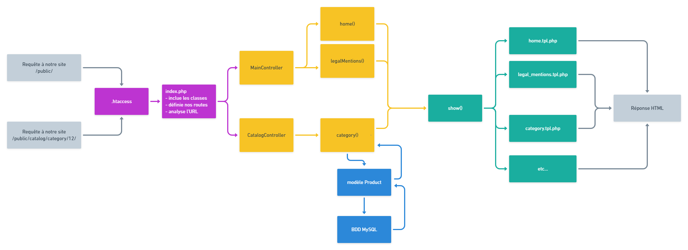

# Recap Projet oShop


## Navigation rapide
1. [Méthode Scrum](#méthode-scrum)
2. [Structure du projet](#structure-du-projet)
3. [Architecture MVC](#architecture--le-modèle-mvc-model---view---controller)
4. [Création d'une page avec MVC](#création-dune-page-avec-mvc)
5. [Héritage](#héritage)
6. [Composer](#composer)
7. [Namespace](#namespace)
8. [Autoload](#autoload)

2 phases dans ce projet :

- Saison 05 = on va mettre en place notre catalogue : affichage de données pré-renseignées en base de données (voir trello)
- Saison 06 = on va mettre en place le backOffice : possibilité de créer des nouvelles entrées en base de données (voir trello)

## Méthode Scrum
Ce projet s'attache à respecter dans la mesure du possible la méthodo agile `Scrum`.

Nous avons définis les rôles de chacun :

- Product Owner = helper/référent de la promo (Romain)
- Scrum Master = le prof (Charles)
- Developer = le prof et les étudiants

Pour plus d'informations sur la Méthode Agile Scrum, vous pouvez consulter le site [L'Agiliste](https://agiliste.fr/guide-de-demarrage-scrum/).

## Structure du projet

### Dossier `public`

Ce dossier contient tous les fichiers "public".  
C'est-à-dire les fichiers qui peuvent être accédés par le client (navigateur).

- `index.php` (_FrontController_)
- fichiers CSS
- fichiers JS
- fichiers images
- `.htaccess` (parce qu'il fait partie du _FrontController_)

### Dossier `app`

Contient tous les fichiers qui n'ont pas besoin d'être accédés par le client (navigateur).  
Ils sont inclus par du code PHP.

- les _Controllers_
- les _Classes_
- les _Templates_ / _Views_
- => tous les fichiers "inclus"

### `app/.htacccess`

```
# on interdit l'accès
deny from all
```

Le fichier `.htacccess` dans le dossier `app` permet d'interdire l'accès au dossier, à ses sous-dossiers et à tous leurs fichiers, DEPUIS LE CLIENT.  
En interne, le code PHP pourra toujours inclure ces fichiers.

### `public/.htacccess`

<details>

<summary>Voir le contenu du fichier .htaccess</summary>

```
RewriteEngine On

# La réécriture d'URL c'est sympa, par contre en cas d'utilisation 
# d'url relative (par rapport au dossier courant), on peut ne
# plus retrouver nos fichiers (css, images, ...) ==> Erreur 404
# Solution : Créer ce qu'on appelle une variable d'environnement qui
# va stocker la partie statique de notre url
# On récupère tout ça : /oclock/hyperion/s05/s05-e02-exo-controllers-views-charlesen
RewriteCond %{REQUEST_URI}::$1 ^(/.+)/(.*)::\2$
RewriteRule ^(.*) - [E=BASE_URI:%1]

# Mon cher Apache, Chaque fois que tu verras /maPage ==> /index.php?page=/maPage
# Mon cher Apache, Chaque fois que tu verras /about ==> /index.php?page=/about
RewriteCond %{REQUEST_FILENAME} !-d
RewriteCond %{REQUEST_FILENAME} !-f
RewriteRule ^(.*)$ index.php?page=/$1 [QSA,L]
```

</details>

Le fichier `.htacccess` dans le dossier `public` permet de créer un entonnoir pour toutes les requêtes HTTP faites par un client (navigateur).

Si la demande du client (URL) ne correspond pas à un fichier existant, ni à un dossier existant, alors, le fichier `public/index.php` sera exécuté (notre _FrontController_).

### `app/`

Ce dossier va contenir les classes de notre projets (Controllers, Models, Views, utils, ...).

:warning: Une bonne pratique à suivre pour les dossiers dans `app` qui vont contenir des classes, est de nommer ces dossiers en _UpperCamelCase_. Non obligatoire pour faire fonctionner PHP, mais recommandée pour faciliter la lecture de la structure d'un projet.

- `app/Controllers`
- `app/Models`
- ...


### `public/assets`

Dossier contenant tous les "atouts" de nos pages HTML.  
C'est la convention/bonne pratique à suivre pour organiser nos dossiers.

- fichiers CSS
- fichiers JS
- fichiers images
- etc.


## Architecture : Le modèle MVC (Model - View - Controller)

- **Front Controller** : c'est notre fichier **index.php**, là où sont redirigées toutes les requêtes de l'application. Peu importe l'url demandée, c'est le front controller qui va la gérer :muscle:.
- **Routeur** : Le composant chargé de récupérer l'url demandée et de la comparer aux routes que nous lui avons données.
- **Routes** : Une correspondance entre une url et une action.
- **Action** : Une action qu'il est possible de faire sur l'application (ex: lister les produits, se connecter, écrire un avis sur un produit etc.). Une action correspond à une méthode de contrôleur.
- **Dispatcheur** : Le composant ou le script (ça peut être très court) chargé d'instancier le bon contrôleur et de lancer la bonne méthode en fonction de la route qui a été identifiée par le routeur. C'est la partie suivante dans index.php

<details>
<summary>Voir le code du dispatcher</summary>

```php
// Est ce que la route est définie dans mon tableau de routage
if ($match) {
    // Si c'est le cas, alors je l'affiche
    $controller = 'oShop\controllers\\'.$match['target']['controller']; 
    $controllerObj = new $controller();

    $method = $match['target']['method'];
    $params = $match['params'];

    $controllerObj->$method($params); // Si method='store'==> $controllerObj->store()
} else {
    // Si elle n'existe pas : on affiche une page 404
    $controllerObj = new oShop\controllers\MainController(); 
    $controllerObj->page404();
}
```

</details>

- **Contrôleur** : Le composant qui regroupe les actions de l'application par contexte (ex: CatalogController pour tout ce qui concerne le catalogue, MainController pour toutes les pages _bâteau_ comme l'accueil, les mentions légales, l'à propos).
- **Modèle** : Globalement, le terme Modèle désigne la partie gestion des données. De toutes les données. Le modèle apporte le dynamisme d'un site. Plus précisément, on désigne par le terme modèle une classe calquée sur une table de la base de données (une colonne = une propriété). Ces modèles vont permettre à toute l'application de manipuler des objets plutôt que des tableaux associatifs.
- **Vue** : Un fragment de HTML qui sera envoyé au client. C'est le contrôleur qui va se charger d'assembler les vues et de leur transmettre les données récupérées par le modèle.

<details>
<summary>
Et le déroulé alors ? On y vient...
</summary>

- Le visiteur accède à une page de votre application. À cette page correspond une url. Cette url peut être un mélange de parties fixes et de paramètres (ex: /catalogue/categorie/4, _/catalogue/categorie/_ est la partie fixe, _4_ est un paramètre).
- Apache, grâce au fichier de configuration _.htaccess_, redirige toutes les requêtes de l'application vers votre front controller (en général, le script _public/index.php_).
- Dans le front controller, le routeur puis le dispatcheur se passent le relais pour traduire l'url demandée en une action (donc une méthode d'un contrôleur).
- Le contrôleur est instancié, la méthode lancée et les éventuels paramètres sont passés à la méthode.
- La méthode du contrôleur va éventuellement faire appel au Modèle (à la couche Modèle) pour récupérer des données à afficher à l'utilisateur, en fonction des paramètres par exemple.
- Puis cette même méthode va assembler les vues qui formeront la page envoyée au visiteur. Les données passées aux vues sont positionnées dans celles-ci, à l'aide de la syntaxe template de php (le `<?=` et les conditions/boucles suivies d'un `:` et fermées par un `end`).

En image c'est encore mieux :wink: : 



</details>

Pour plus d'informations, voir la fiche récap sur MVC :tada: https://github.com/O-clock-Alumni/fiches-recap/blob/master/gestion-projet/modele-vue-controller.md


## Création d'une page avec MVC

### Route

- coder la route dans le fichier **index.php** grâce à AltoRouter

Celui-ci permet :
- de gérer une URL précise
- et d'y affecter une méthode d'un _Controller_

le _Dispatcher_ va ensuite s'occuper d'instancier le _Controller_, puis d'appeler la méthode adéquate.

### Controller

- Créer le _Controller_ s'il n'existe pas encore dans **app/controllers**.
- déclarer la méthode dans ce _Controller_
- dans le corps de cette méthode
  - écrire le code permettant d'afficher la demande initiale
    - récupérer les données si nécessaire (en appellant le _Modèle_, voir ci-dessous)
    - générer le code HTML grâce à un _View_
    - Si c'est la méthode "show" : `$this->show('view-name', $dataArray);` où `$dataArray` est un tableau associatif contenant toutes les données à transmettre à la _View_

### View

- créer une _View_ dans **app/views**
- mélanger code HTML et code PHP
- la _View_ va utiliser les données transmises par la méthode de _Controller_
  - => du PHP : `<?= $varToDisplay ?>`

### Models

- plus haut, on parlait de : "_récupérer les données_"
- les données (souvent d'une base de données) sont à récupérer grâce aux _Models_
- pour chaque donnée nécessaire pour la page :
  - instancier le _Model_ correspondant à la table contenant les données désirées
  - appeler la méthode retournant les données nécessaires (et stocker le résultat dans une variable)
  - si cette méthode n'existe pas encore, la déclarer et la coder


## Héritage
L'héritage est un des grands principes de la programmation orientée objet (POO).

<details>
<summary>
En savoir plus
</summary>

L'idée derrière cela est de définir une classe `Mère` qui contiendra des méthodes ou des propriétés génériques. Cette classe pourra ensuite être appellée (extends) par d'autres classes dites `Enfants`.

 Prenons le cas d'un véhicule. Dans cette catégorie on retrouve :
 - Les vélos
 - Les tricycles
 - Les voitures simples
 - Les camions
 - ...

 Tous les véhicules ont à priori des caractérisques communes : une couleur, la possibilité de rouler ou de freiner, ...

 On va donc stocker ces caractéristiques communes (méthodes et propriétés) dans une seule classe [`Vehicule`](Vehicule.php) et l'on crééera des classes [`Velo`](Velo.php) ou [`Tricycle`](Tricycle.php) qui hériteront de [`Vehicule`](Vehicule.php).


## Visibilité
Les propriétés et méthodes d'une classe peuvent être mises à disposition de toute partie du code ou restreinte à une partie.

### `public`

C'est "open bar".

Les propriétés sont accessibles et modifiables **depuis n'importe quelle partie du code**.  
Les méthodes peuvent être appelées **depuis n'importe quelle partie du code**.

### `private`

C'est "fermé à clés".

Les propriétés sont accessibles et modifiables **depuis le code de la classe uniquement**.  
Les méthodes peuvent être appelées **depuis le code de la classe uniquement**.

### `protected`

C'est "pour la famille".


Les propriétés sont accessibles et modifiables **depuis le code de la classe, de ses enfants et de ses ancêtres**.  
Les méthodes peuvent être appelées **depuis le code de la classe, de ses enfants et de ses ancêtres**.

### Analogie

_Je suis dans ma maison, et toutes les portes et fenêtres sont grandes ouvertes_  
=> `public`

_Je suis dans ma maison, et j'ai fermé les fenêtres et fermé les portes à double-tour_  
=> `private`

_Je suis dans ma maison, et j'ai fermé les fenêtres et fermé les portes à double-tour, mais j'ai donné un double à mes parents et à mes enfants_  
=> `protected`

</details>

## Composer

Gestionnaire de dépendances qui permet d'installer des librairies PHP. 

Une librairie est un bout de code créé par des développeurs , pour les développeurs,  afin de se simplifier la vie.

<details>
<summary>
En savoir plus
</summary>

### Installation d'une librairie (ou dépendance) en ligne de commande
```bash
composer require leNom/deLaLibrairie # Voir la commande sur packagist.org
```

Pour [var-dumper](https://packagist.org/packages/symfony/var-dumper), par exemple : 

```bash
composer require symfony/var-dumper
```

### Installation des dépendances à partir du fichier composer.json
```bash
composer update
```

### Listing de toutes les dépendances disponibles

Voir le site https://packagist.org/


### Dossier vendor
Lors de l'installation de librairie avec composer, un dossier vendor était généré automatiquement.

Le code source des librairies/dépendances ne doit jamais être modifié.
Ainsi, pourquoi les versionner ? (ajouter dans Git)
=> on va dire à Git d'ignorer le dossier vendor

Il faut Ajouter ce qui suit dans le fichier **.gitignore** :
```
# ignorer les fichiers & dossiers liés à Composer
# sauf composer.json bien sûr
vendor/
```

</details>

## Namespace

Un namespace est un "dossier virtuel" dans lequel est rangé une classe

- permet d'avoir plusieurs classes du même nom
- doit être déclaré au début du fichier
- n'est valable que pour le fichier
- le séparateur de "dossiers" est le `\`

<details>
<summary>
En savoir plus
</summary>

## Création d'un _Namespace_ dans une classe PHP

La classe `Avengers` est "rangée" dans le "dossier virtuel" `Cinema\ScienceFiction\MarvelFilms`

```php
<?php

namespace Cinema\ScienceFiction\MarvelFilms;

class Avengers {
    // [...]

    public function play() {
        // [...]
    }
}
```

:warning: Toute classe "utilisée" dans ce code :arrow_up: sera considérée comme faisant partie du _Namespace_ de la classe (chemin relatif).

```php
<?php

namespace Cinema\ScienceFiction\MarvelFilms;

class Avengers {
    // [...]

    public function play() {
        // [...]
        $aquaman = new Aquaman(); // => \Cinema\ScienceFiction\MarvelFilms\Aquaman
    }
}
```

Pour éviter cela, il faudra spécifier le FQCN de la classe (chemin absolu, voir plus bas).

### Fully Qualified Class Name

C'est le "chemin absolu" de la classe => le _Namespace_ + le nom de la classe

```php
<?php

$avenger = new \Cinema\ScienceFiction\MarvelFilms\Avengers();
$avenger->play();
```

### Mot-clé `use`

Dès qu'on "utilise" au moins deux fois la classe dans un fichier PHP, il est intéressant de ne pas avoir à stipuler le FQCN

- comme le mot-clé `namespace`, `use` n'est valable que pour le fichier courant
- le premier `\` est optionnel car il est implicite
- il doit être placé en haut du fichier, après le mot-clé `namespace` s'il y en a un

```php
<?php

use Cinema\ScienceFiction\MarvelFilms\Avengers;

$avenger1 = new Avengers();
$avenger1->play();

$avenger2 = new Avengers();
```

### Classes natives PHP & Classes d'autres _Namespaces_

Toutes les classes natives de PHP ne sont dans aucun _Namespace_.  
Ainsi, elles se trouvent à la racine des _Namespace_.

```php
<?php

namespace Cinema\ScienceFiction\MarvelFilms;

use Cinema\ScienceFiction\DCComics;

class Avengers {
    // [...]

    public function play() {
        // [...]
        $aquaman = new Aquaman(); // => \Cinema\ScienceFiction\DCComics\Aquaman

        // Utilisation de la classe PDO, native à PHP (donc hors namespace)
        $pdo = new \PDO();
    }
}
```


</details>

L'une des principales application des Namespaces est la possibilité de charger (`require`) intelligement des classes PHP grâce au mécanisme d'autoloading (voir ci-dessous).

## Autoload

Une bonne pratique en PHP objet consiste à ranger les classes dans différents fichiers. Le problème c'est que l'on est obligé ensuite de faire beaucoup de require pour charger nos différentes classes. 

Heureusement l'autoloading nous permet de reméditer à ce problème en incluant les classes dès que l'on en a besoin.

<details>
<summary>
En savoir plus
</summary>

### PSR-4

Le "dossier virtuel" de chaque classe (son _Namespace_) est une représentation du dossier réel dans lequel le fichier déclarant la classe est placé.  
Le fichier déclarant la classe est du nom exact de la classe.

```php
<?php
// PHP 5.3 and later:
namespace NomDuProjet\Model;

class Brand
{
}
```

## Mise en place

### #1 - configurer l'autoload avec Composer

Dans le fichier composer.json

```js

    "autoload": {
        "psr-4": {
            "NomDuProjet\\": "app/"
        }
    }
```

Puis, pour chaque modification de cette partie "autoload" du fichier composer.json, on exécute la commande :  
`composer dump-autoload`

:warning: On oubliera pas le `require 'vendor/autoload.php'` dans notre fichier `index.php` pour que les dépendances soient accessibles.

### #2 - on "place" chaque classe dans un namespace

Au début de chaque classe, on précise le namespace (dossier virtuel) dans lequel elle se trouve.

Exemple, pour la classe MainController se situant dans `app/controllers/MainController.php`

```php
<?php

namespace NomDuProjet\Controllers;

class MainController {
    // ...
}

```

### #3 - utilisation de nos classes

Désormais, `MainController` ne suffit plus pour déterminer la classe `MainController` qui se situe dans `app/controllers/MainController.php`.

On doit préciser son Fully Qualified Class Name (FQCN), c'est-à-dire son "chemin absolu" (commençant par `\`).

```php
<?php

$controller = new \NomDuProjet\controllers\MainController();
$controllerBis = new \NomDuProjet\controllers\MainController();

```

## Debug

- vérifier que tous les fichiers sont sauvegardés
- ré-exécuter la commande `composer dump-autoload`
- vérifier la présence de `require 'vendor/autoload.php'` dans le code du projet (index.php)
- vérifier que le use ou le FQCN est correct, à la majuscule/minuscule près
- vérifier que la classe est bien placée dans le bon namespace
- vérifier que le namespace de la classe est correct, à la majuscule/minuscule près

</details>